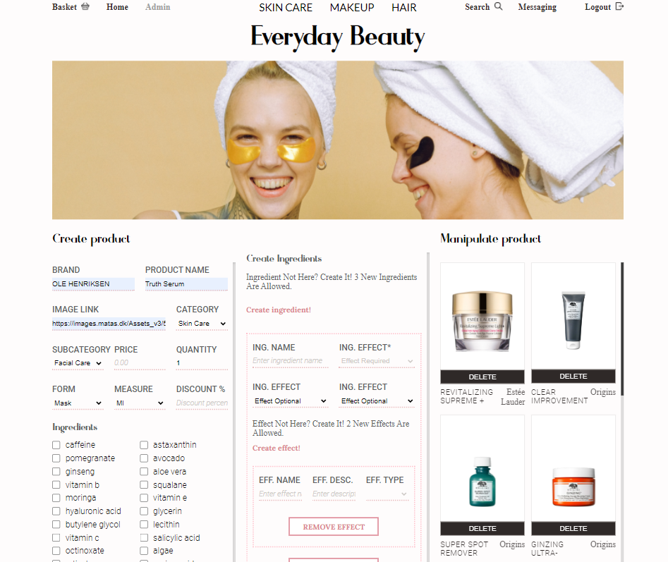

## NodeJS Beauty Shop
A personal project that combines the power of graphs and documents with a relational database. Node based authentication and a recommendation system are provided to the user, alongisde with an admin panel for CRUD on products.

### Technologies
  - Node v12.18.3
  - MySQL Workbench
  - ArangoDB v3.7 
  - SASS

### Features
  - Admin Panel ( CRUD product management )
  - Dashboard 
  - Product View 
  - Recommendation System ( based on graphs )
  - Node-based Authentication System

